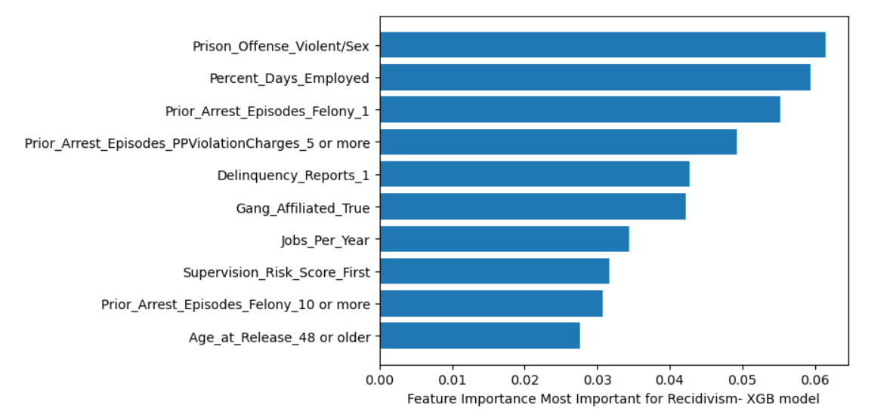

# RecidivismChallenge

Based on [this challenge](https://nij.ojp.gov/funding/recidivism-forecasting-challenge), attempt to predict prisoner recidivism using classification models.

[Here](ModellingAndAnalysis.ipynb) is the in depth analysis and conclusions including source code for all models used and the entire process.

### Data
Data on recidivism from NIJ. [Here](https://nij.ojp.gov/funding/recidivism-forecasting-challenge).

### Methodology
1. Data - Data was pre-split into training and test sets for the competition. Basic preprocessing such as encoding and scaling was done, but otherwise the data was already quite clean. A few nonsensical values were removed.
2. Models - ran 4 models
 - Xgboost model
 - Ridge model
 - Adaboost model
 - The improved and final XGboost model
3. Cross validation - 5 fold cross validation with hyperparmeter tuning. 
4. Evaluation - evaluated using the brier loss score of the predicted probabilities. This is what the competition used, but also, this allows actionable results when the model has a high confidence in a result.

### Goal
Successfully predict which prisoners will recidivate and which will not

# Insights

### Insight 1: Stereotypical red flags are real, but job trends are actually the most important

This is common knowledge in the used car industry, but it is a very important factor in determining the price of a used car. Our model considered this the tenth most important feature, but it is important to note that almost all of the features above it pertained to the manufacturer and the fuel type of a car. Indicating that when adjusted for manufacturer and fuel type, the year of the car is one of the absolute best indicators of whether or not a car will sell for a high price.

## Final Notable Findings and Conclusions

1. **Numerical Results:** We are able to produce a model using XGboost that has a brier loss score of 0.1765932441126029. Which is pretty close to the competition models. Adaboost produces a brier loss of 0.21760775937714114 with only one coefficient, making it a very shallow linear Adaboost model. As far as the raw number of correct classifications. The XGboost model, which is the superior one, has about a 3:1 ratio of correct guess:incorrect guesses in terms of both false positive rate and false negative rate.
2. **Feature Importance:** The most important factors for determining recidivism are related to how many jobs the person has had, and a certain degree of red flags in their record such as especially heinous crimes (violent sex crimes), gang affiliation, delinquency reports, and supervision risk score. It is especially notable, that we were able to find a model with brier score of around .22 that was only based on the percentage of days a prisoner was employed and nothing else.
3. **Actionable high confidence intervals:** When the model is 90% or more certain the prisoner will recidivate, they have a 96% recidivism rate in practice, and when the model is 85% or more certain the prisoner will not recidivate, they have a 93% chance to not recidivate. Out of the remaining 7%, only 20% of those were convicted of a violent crime.

This model is probably usable in some real world application the way it is at the moment. As this is a very sensitive subject and prisoners are very vulnerable to abuse, you would likely want to use the very high confidence intervals that result in only the most extreme ends of the spectrum being classified by the model. With that being said, here are some potential suggestions for actionable steps:

1. **Readjustment programs for the high confidence non-recidivists:** Since the non-recidivists with 85% confidence had a 93% chance to not reoffend. Some sort of targetted "readjustment to life outside of prison" or other similar program could potentially help those who are determined by the model as having the lowest risk of recdivism. In theory, prisons should be doing this anyways, but they are often underfunded. So this would help them target inmates for whom this type of program will have the biggest positive impact.
2. **Watch lists for recidivists**: Prisoners determined by the model to have a greater than 90% chance of recividism, have in practice a 95% recidivism rate. These prisoners should likely be on some form of watch list. Due to legal reasons, I don't think I would have confidence to say they should not be elligible for parol, but at the very least, I think police should be alerted about these individuals being released, so that they can keep them high on a list of suspects if any crimes similar to their MO are committed in their area in the future.

